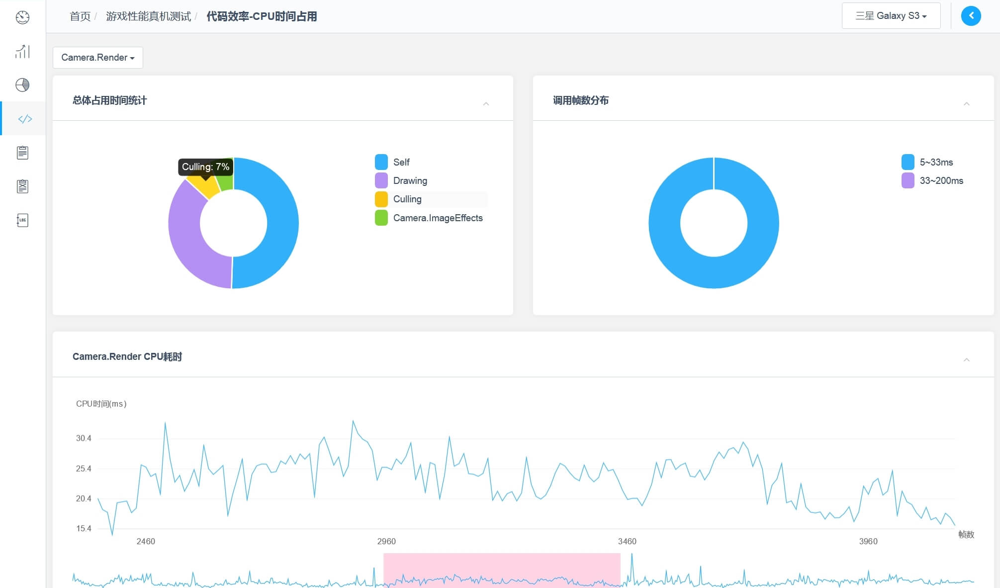

1. 优化理论
   1. [Amdahl定律----优化最有显著作用部分的法则，评测的优化效果的基准](./theory/Amdahl_Law.md "优化理论" )
2. 剖析工具教程
   1. [Snapdragon剖析器的使用教程](./tool/Snapdragon_Profier_Tutorial/SnapdragonProfiler_Tutorial_01.md "")
   2. [用Instruments做Unity在iOS平台的性能调试](./tool/Profile_Unity_Game_in_XcodeInstruments/Profile_Unity_Game_in_XcodeInstruments.md "")
   3. [Unity Profiler使用说明](./tool/Unity_Profiler_Tutorial_01/Unity_Profiler_Tutorial_01.md "")
   4. [对比Unity Profiler工具与Xcode Instruments的优缺点](./tool/Diff_by_Unity_Profiler_and_Xcode_Instruments/Diff_by_Unity_Profiler_and_Xcode_Instruments.md "")
3. 通用优化手段
   1. [写更适合Unity的C#代码来提高性能](./generic/CSharp_in_Unity_for_fast/CSharpForUnity.md "")
   2. [C#的通用优化](./generic/CSharp_generic_issues.md "")
4. 优化专案
   1. [《神无月》游戏项目的性能优化](./case/ShenWuYue_Opt/ShenWuYue_Opt.md "")
   2. [传世3D游戏项目优化](./case/Wol3D_Optimize/Wol3d_game_project_optimize_diff.md "")
   3. [传世3D的后期效果优化](./case/Wol3D_PostFX_Optimize_Dir/Wol3D_PostFX_Optimize.md "")

