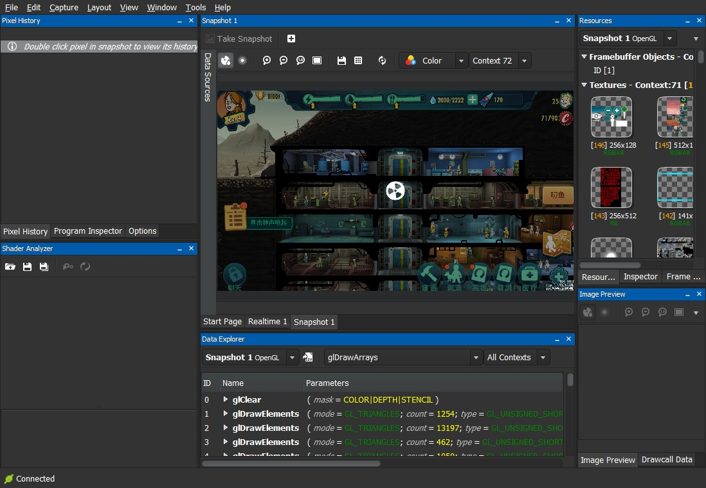
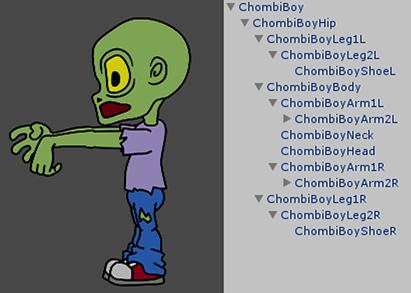
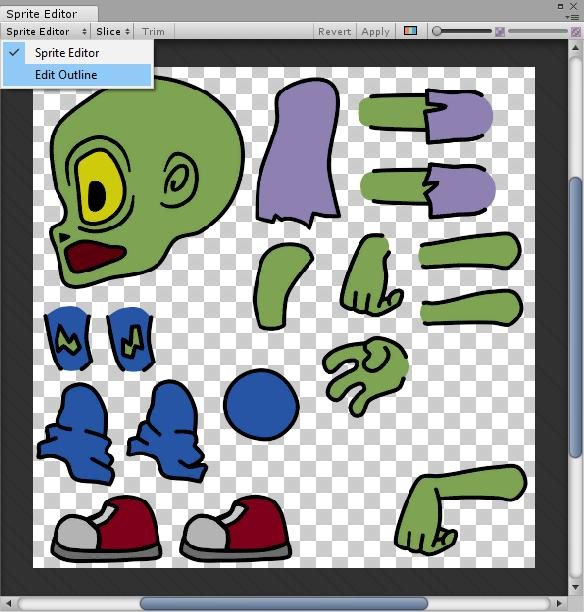
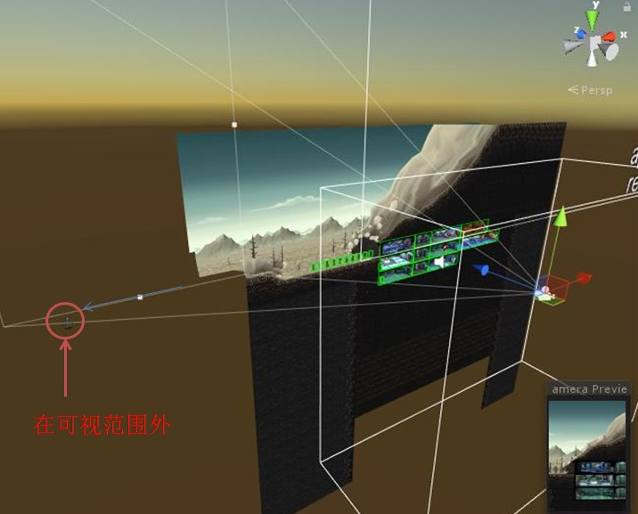
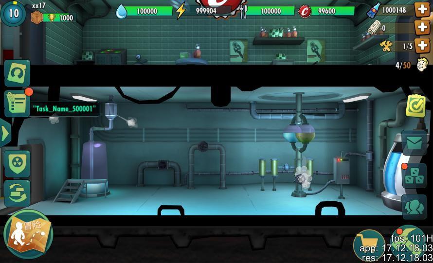
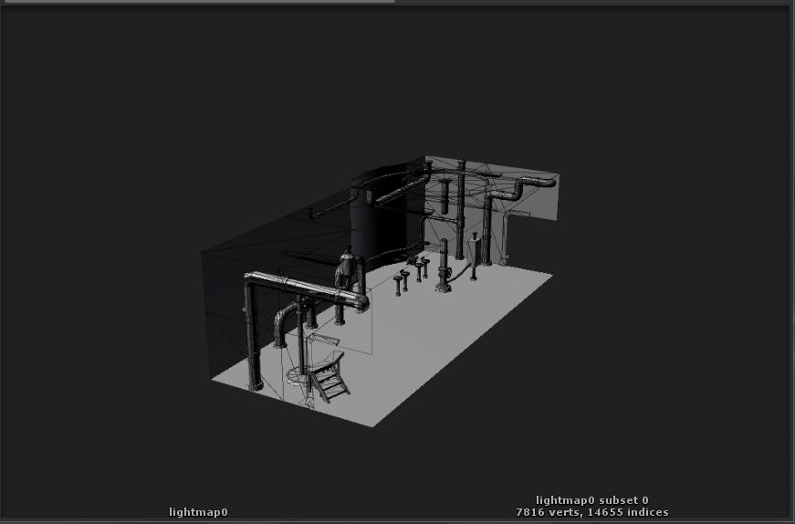
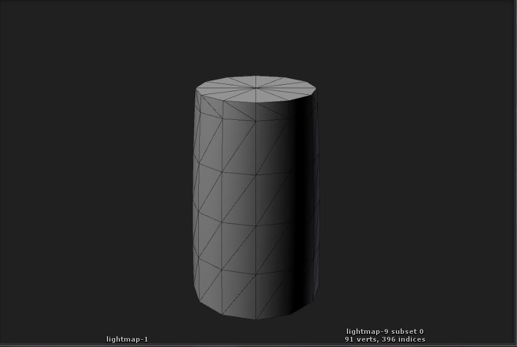

# 《辐射--避难所》项目性能优化建议

[TOC]

## 主要分析工具如下列表：

1. Unity Profiler

2. Unity Frame Debugger

3. Snapdragon Profiler，剖析时，如下图

   

经过对代码的review，和对项目资源的组织，发现如下一些问题，并提出了可行的改进建议：

## 1. 游戏中人物角色是纯2D的，但用的是GPU Skinned方式做角色动画

如下图：

由于一个角色采用21个骨骼，当摄像机范围内都是建筑时，会最大达到30个房间，平均一个房间有3个2D角色，就会有21\*30\*3=1890个骨骼矩阵要计算，这个GPU端的开销非常大，而且游戏中不存在动作融合的情况，没必要使用这项技术实现人物的动作动画，而应该采用低开销的，适合2D觉得色技术，就是改为Unity内置的基于Sprite的Sprite Group动画，组合动作使用BlendTree来解决，这么做使得大量的顶点与骨骼矩阵的乘法运算从GPU端释放，成为少量的CPU端的简单几何体的刚性translate的计算。在Unity中的做法如下图，把角色的腿、脚、躯干、头....按人体结构拼接，挂在一个类似"ChombBoy"的根节点下：

其纹理如下，可以拼接到一个atlas中:

## 2. 有做整个游戏场景的可视性剔除，但是对于物体没有做lod。

隐藏物体的方式用的是切换到不可见的层里，这种方式性能开销较大，可以采用把物体坐标移出Camera Frustum来实现物体的隐藏，如下图：

## 3. 房间的平均顶点数过多

需要适当减面，一些物品也是，这有助于提高dynamic batch的概率。

比如，下面这个房间为例，其视觉效果如下：

效果很好，但付出的代价很高，就如下面这张取自Frame Debugger的图中显示，这个房间使用了7816个顶点，其中圆管，门框多加的多边形细节完全过多，粗略算可以去除1/4的面后保持视觉质量不变。

再看下图，这是一个打算放在角落里的圆筒物体，在纵向方向上过多的section list分布，完全可以去除两组顶点loop，圆剖面也是细分的过多，可以适当减少细节。

## 4. 局部代码存在低性能的foreach使用

存在自己实现的给Dictionary用的enumerator，从而在循环的过程中在堆中产生额外的内存开销，所以应当尽可能使用传统的for函数来完成。