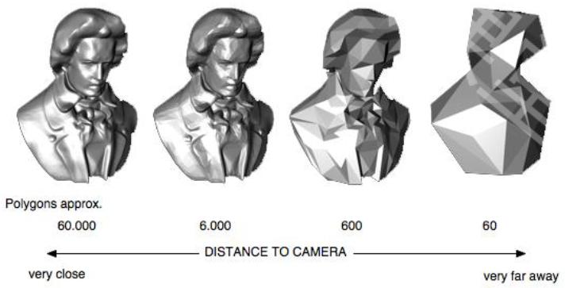
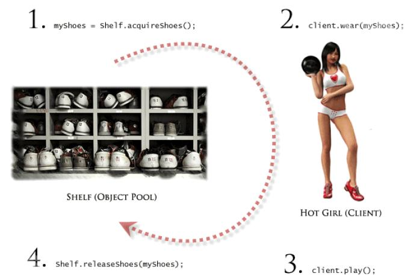

# 《神无月》游戏项目的性能优化


[TOC]

---

**本文由游戏技术中心张华和客户端专家委员会谈欣诚共同整理。**

---

### 什么是性能优化

- 游戏运行流畅

- 设备耗电量、发热量更低

- 崩溃率降低

- 在不同设备和平台上的兼容性提高

  ​

### 先期制定优化任务的迭代流程


### 对比标准

- 相同手机、相同温度测试

---

### 项目具体的优化工作的展开

- 69条建议

- 66条采纳

- 自动化资源定期检查

  - 编写检查函数代码，用Jenkins持续运行

- 每周手动固定测试用例检查

  - 内存测试（登陆->角色创建->新手地图->主城）

- 优化实施的时间成本 ---- 6周

  


### 发现和定位瓶颈----可以采用工具

- Unity Profiler真机测评

- 自己开发性能测试工具

- 第三方性能工具和平台

  - Adreno Profiler

  - WeTest

  - UWA

    


### 明确清晰的性能参数

- 瞬卡与平均帧数（Lag & fps）
- 渲染批次数（Drawcall）
- 内存使用量（Memory）
- 崩溃率（Crash）
- 包体大小（Install File Size）

---

### 发现主要性能问题

- 主界面场景，平均帧数比较低
- 每场战斗时不够流畅，偶有明显瞬卡

### 分析思路

- Drawcall数量瞬时翻倍
  - 除了主摄像机外，还有其他的摄像机也开着，造成了浪费
- 出现新对象时，大量瞬卡
  - 游戏运行中主线程同步加载资源，导致瞬卡
- 渲染特效时，帧数明显降低
  - 不合理的资源制作方法：折射特效（Grab抓屏）

### 试验策略

- 如非必要，无增实体

  - 视野外逻辑更新

  - 冗余计算、重复代码

  - 资源导入错误配置

  - 载入多份同样资源

  - 资源冗余缓存未释放

    

- 负载均衡 并行处理

  - 多线程分摊压力
  - 利用GPU分摊CPU压力

- 性能效果权衡

  - 合理利用LOD策略

  - 根据配置做高中低挡选择

    


### 优化的焦点

- 场景

  - Lightmap优化参数设置
    - Lightmap的LOD
      - 近处高精度，远处低精度
    - Lightmap的尺寸
      - 1024尺寸 会有助于减少渲染drawcall
    - Lightmap有点糊怎么办？
      - 调整参数

- 角色

  - LogicCull 逻辑预裁剪
  - LOD
    - 主角LOD100
    - 其他玩家LOD50，LOD25

- 特效

  - 优化shader 中的 GrabPass

    - 抓屏次数过多

      ```c
      SubShader
      {
      	“OneGrabTexture” //取个名只抓一次
      }
      ```

    - 特效LOD

- 资源管理

  - 资源管理优化

    - 异步加载

      - 《神无月》战斗场景瞬卡

    - 对象回收复用

    - 任务过多时延迟加载

    - 使用离线处理结果

      

- Shader

  - 理解Shader处理方式（并行计算）

    ```C#
    float3 color = float(0,1,0);
    color += DiffuseColor(p1, p2);
    color += SpecularColor(p1, p2);
    return color;
    // return color + color1 + color2;
    条件语句
    if( color.a > 0.5)
    {
    	function1();
    }
    else
    {
    	function2();
    }
    ```

  - Shader 参数类型

    - fixed half float

  - 用宏去控制Shader的逻辑

    - \#pragma multi_compile ___ XXXX
    - \#ifdef XXXX
    - \#endif
    - Shader.EnableKeyword(“XXXX”);

- HUD优化

  - 名字渲染Drawcall优化
  - 掉落物品优化

- 制定资源规则

  - 根据不同目标平台
    - 角色LOD，分主角（高）、其他玩家（中，低）
    - 特效LOD，特效经自动资源处理成H、M、L三版本
  - 规划总安装包大小
    - 增加某部分资源，其他资源需要相应减少

- 系统配置项

  - 开启多线程渲染MultiThreadRendering
  - 开启il2cpp，将逻辑脚本代码编译为cpp本地代码

---

### 取得的效果

第三方平台测试结果 -- -- WeTest平台高中低三档都达到标准

---

### 哪些方面还可以做得更好

- 前期的规划有待更多的准备 ---- 减少返工
- 执行的技术标准有待提高 ---- 想要60分通过考试，就得目标定在70分的自测标准上！

### 优化工作的总结

- 性能测试自动化
- 有规律的定期检查
- 早发现早治疗
- 保持与团队中各成员的良好沟通，目标一致，步调一致

