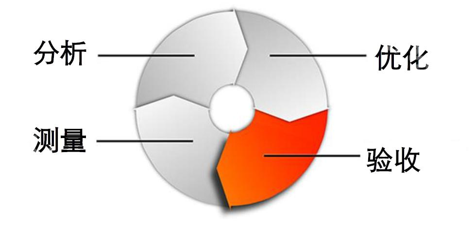

#《传世3D》游戏项目的性能优化


[TOC]

---

**本文由游戏技术中心张华和客户端专家委员会谈欣诚共同整理。**

---

### 什么是性能优化

- 游戏运行流畅
- 设备耗电量、发热量更低
- 崩溃率降低
- 在不同设备和平台上的兼容性提高
###先期制定优化任务的迭代流程



### 对比标准

- 相同手机、相同温度测试

---

### 发现和定位瓶颈----可以采用工具

- Unity Profiler真机测评
- 自己开发性能测试工具
- 第三方性能工具和平台
  - Adreno Profiler

  - WeTest

  - UWA

    
###明确清晰的性能参数

- 瞬卡与平局帧数（Lag & fps）
- 渲染批次数（Drawcall）
- 内存使用量（memory）
- 崩溃率（crash）
- 包体大小（install file size）
---

###发现主要性能问题

- 100人同屏时，帧数比较低

- 瞬间出现大量人手时容易瞬卡

###分析思路

- Drawcall数量瞬时翻倍
  - 除了主摄像机外，还有其他的摄像机也开着，造成了浪费
- 出现新对象时，大量瞬卡
  - 游戏运行中主线程同步加载资源，导致瞬卡
- 多人战斗时性能很低
  - 骨骼动画
  - 蒙皮
  - 渲染压力
  - 逻辑更新
###试验策略

- 如非必要，无增实体
  - 视野外逻辑更新

  - 冗余计算、重复代码

  - 资源导入错误配置

  - 载入多份同样资源

  - 资源冗余缓存未释放

    
- 负载均衡 并行处理
  - 多线程分摊压力
  - 利用GPU分摊CPU压力
- 性能效果权衡
  - 合理利用LOD策略

  - 根据配置做高中低挡选择

    
###优化的焦点

- 场景
  - Lightmap优化参数设置
    - Lightmap的LOD
      - 近处高精度，远处低精度
    - Lightmap的尺寸
      - 1024尺寸 会有助于减少渲染drawcall
    - Lightmap有点糊怎么办？
      - 调整参数

- 角色

  - LogicCull 逻辑预裁剪
  - LOD
    - 主角LOD100
    - 其他玩家LOD50，LOD25

- 特效

  - 优化shader 中的 GrabPass

    - 抓屏次数过多

      ```c
      SubShader
      {
      	“OneGrabTexture” //取个名只抓一次
      }
      ```
    - 特效LOD

- 资源管理

  - 资源管理优化
    - 异步加载

    - 对象回收复用

      - 《传世3D》游戏场景 

    - 任务过多时延迟加载

    - 使用离线处理结果

      

- Shader

  - 理解Shader处理方式（并行计算）

    ```C#
    float3 color = float(0,1,0);
    color += DiffuseColor(p1, p2);
    color += SpecularColor(p1, p2);
    return color;
    // return color + color1 + color2;
    条件语句
    if( color.a > 0.5)
    {
    	function1();
    }
    else
    {
    	function2();
    }
    ```

   - Shader 参数类型

     - fixed half float

   - 用宏去控制Shader的逻辑

     - \#pragma multi_compile ___ XXXX
     - \#ifdef XXXX
     - \#endif
     - Shader.EnableKeyword(“XXXX”);

- HUD优化

  - 名字渲染Drawcall优化

  - 掉落物品优化

    

- 制定资源规则

  - 根据不同目标平台
    - 角色LOD，分主角（高）、其他玩家（中，低）
    - 特效LOD，特效经自动资源处理成H、M、L三版本
  - 规划总安装包大小
    - 增加某部分资源，其他资源需要相应减少

- 系统配置项

  - 开启多线程渲染MultiThreadRendering
  - 开启il2cpp，将逻辑脚本代码编译为cpp本地代码
---

### 取得的效果

- 对比主流MMO，《传世3D》各项性能指标处于领先

- 第三方平台测试结果 -- -- WeTest平台高中低三档都达到标准

- 优化前后对比，效果显著

  - 优化后

    

  - 优化后

    

  - 前后最明显的差异就在

    其每一次Camera.Render相比没做优化前的有了极大的节省，虽说没有看到的有一个数量级的节省，其实已经有极大的改善。Overhead也从占用总开销的3.6%降到1.3%，这也说明ＣＰＵ的使用得到了更有效的改进，许多的冗余代码从中得以剔出。


---

### 哪些方面还能做得更好

- 突破200人同屏
  - 采用 GPU Animation Instancing
  - 使用Native代码，替换计算密集型的操作
- 前期的规划、制作工艺和技术标准 -- -- 合理的前期规划，事半功倍，减少返工

### 优化工作的总结

- 性能测试自动化
- 有规律的定期检查
- 早发现早治疗
- 保持与团队中各成员的良好沟通，目标一致，步调一致


