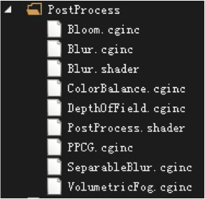
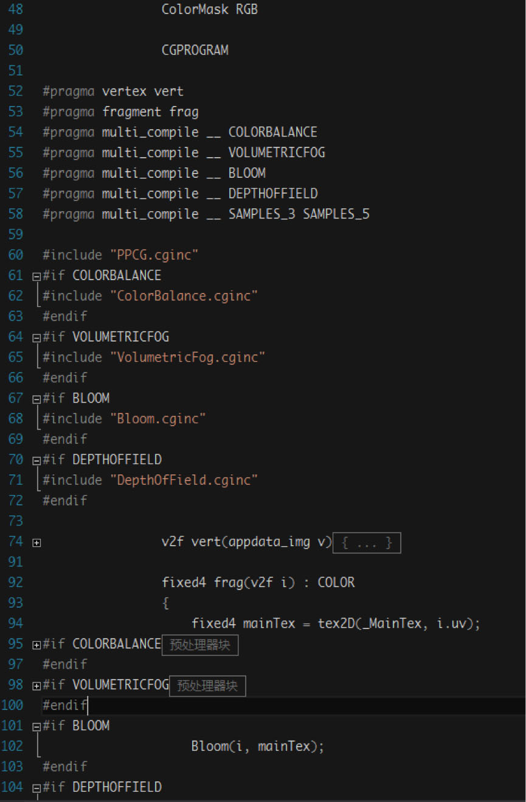
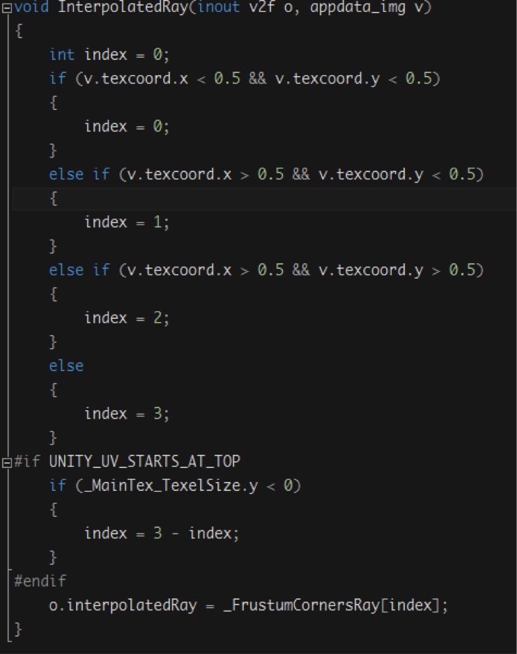
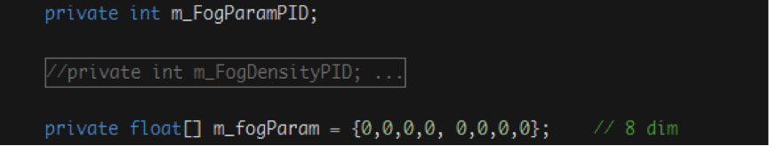
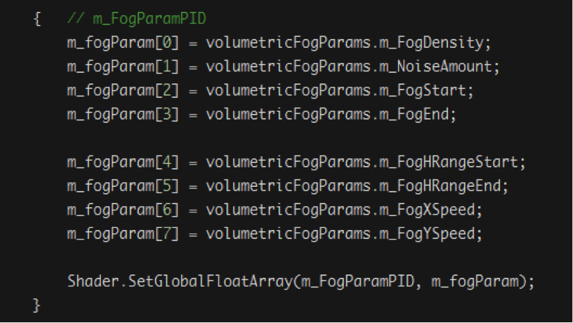
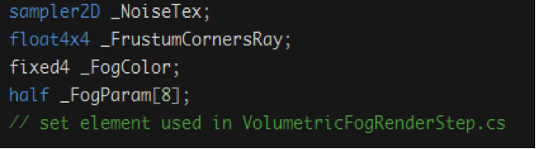

# 后期效果性能优化的分析和学习—— 在《传奇世界3D》中的应用

[TOC]

## 大局观

code review获得的整个后期效果模块中shader的关键函数调用结构和文件结构：

### 调用结构

~~~C++
Blur.shader
Pass {
	vert = vert_img_aa
			SAMPLES_N
	frag = frag -> BlurTex -> SampleTex
			GAUSSIAN_KERNEL, BLUR_RADIUS_N
}

PostProcess.shader
Pass {
	vert = vert_img_aa
			SAMPLES_N
	frag = fragBloom
}
Pass {
	vert = vert -> InterpolatedRay [VFog]
	frag = frag -> ColorBalance -> getCurve
								-> getLuma
								-> VolumetricFog
								-> Bloom -> Screen -> Screen1
								-> DepthOfField
}
~~~

### 文件结构：

## 关注点1

&emsp;&emsp;游戏里加后期效果是个全屏的操作，表达景深(Depth of Field)和辉光(Bloom)效果少不了做全屏模糊(Blur)，而为了得到较好的模糊或会使用几次高斯模糊，同时抖机灵的程序员都会想到每一次模糊迭代伴随一次降采样(Down Sample)，就是让图像解析出成为上一次的一半，面积是原来的1/4，其中RenderTexture.GetTempory(...)的多次使用和之后的Grphics.Blit操作虽然调用次数多，但在降采样的策略下，操作的fragment总共没超过两倍的screen的大小，因为之前的弟兄可是头一个blit的就是1/4大小的图像。

&emsp;&emsp;这值得称赞其"机灵"程度，也说明我这里没有下手的机会。

## 关注点2

所有的操作集中在两个shader文件里(Blur.shader, PostProcess.shader)，其它的是被以\*.cginc方式include进来。代码中有用到

我想能否把两个shader并一个去可以减少content切换的想法立马就没了，因为官方文档里有提到，一旦用\#pragma\_compile，Unity就会为多个keyword路劲，产生他们的交叉组合的着色器，其数量取决于keyword的多少，这就意味着我那点的减少一两次的content切换，多于项目中用了6个keyword产生的组合（实际有6x6 个shader）来说，是无济于事的。这不是用C++写引擎的时候，可以轻易改动Unity底层的。

此路不通。

## 关注点3

Shader中if，for内部是否存在慢速操作？是否可以替换，或是可以展开？

-   只有一处大量使用if的void InterpolateRay(inout v2f o, appdata\_img v)函数，仔细一看，抖机灵的程序员早就优化了，所有if else 里处理的都是一个简单的int临时变量，然后于函数结尾处，if分支外部集中处理，用那个int index做数组下标索引，具体代码如下：

    

    值得赞许的优化！我没活了....

-   Fixed4 BLurTex(sampler2D \_tex, v2f\_img input, half \_stepSizeScale)中有的for，看是否有机会？

    代码如下：

~~~C++
for(int i=0; i<=blurRadius*2: i++) {
	half2 curUV = cu + finalStepSize * half(i -- blurRadius);
	res.rgb += SampleTex(_tex, curUV).rgb * blurKernel[i];
}
~~~

​	相关的变量定义如下：

~~~C#
const tint blurRadius = 5;
Half2 finalStepSize = ....;
Float2 cu = input.uv;
~~~

机会来了，此代码可以展开如下：

因BlurRadius \* 2 = 10;

得到

~~~C++
half2 curUV;
curUV = cu + finalStepSize *-5;
res.rgb += SampleTex(_tex, curUV).rgb * blurKernel[0];
curUV = cu + finalStepSize *-4;
res.rgb += SampleTex(_tex, curUV).rgb * blurKernel[1];
curUV = cu + finalStepSize *-3;
res.rgb += SampleTex(_tex, curUV).rgb * blurKernel[2];
curUV = cu + finalStepSize *-2;
res.rgb += SampleTex(_tex, curUV).rgb * blurKernel[3];
curUV = cu + finalStepSize *-1;
res.rgb += SampleTex(_tex, curUV).rgb * blurKernel[4];
curUV = cu; // 这里省了点运算
res.rgb += SampleTex(_tex, curUV).rgb * blurKernel[5];
curUV = cu + finalStepSize *1;
res.rgb += SampleTex(_tex, curUV).rgb * blurKernel[6];
//..... 节省版面吧 \\
curUV = cu + finalStepSize *5;
res.rgb += SampleTex(_tex, curUV).rgb * blurKernel[10];
~~~

## 关注点4

用Shader.SetGlobalXXX(... ) / Material.SetXXX(...)是否高效?

Unity5已经可以用SetFloatArray(... )传递浮点数组和SetVectorArray(...)传递矢量数组，一批零散的数据逐个的设置到shader速度不仅慢速，而且由于GPU端的寄存器一般是以打包的方式存储数据的，所以逐个设置还会造成GPU的memory padding，所以发现一下可以优化的代码：

-   VolumetricFog.cginc内有8个作为参数的half全局变量可以优化，同时对应的VolumetricFogRenderStep.cs相应Shader.SetGlobalFloat( .... )可以换成一个Shader .SetFloatArray

> C\#代码里如下定义:
>
> 
>
> C\#里如下使用:
>
> 
>
> Shader里如下定义参数 \_FogParam\[8\]:
>
> 
>
> 这么做了后，在一些机器上会有些许性能提升。

