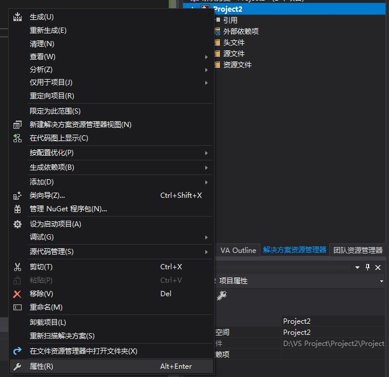
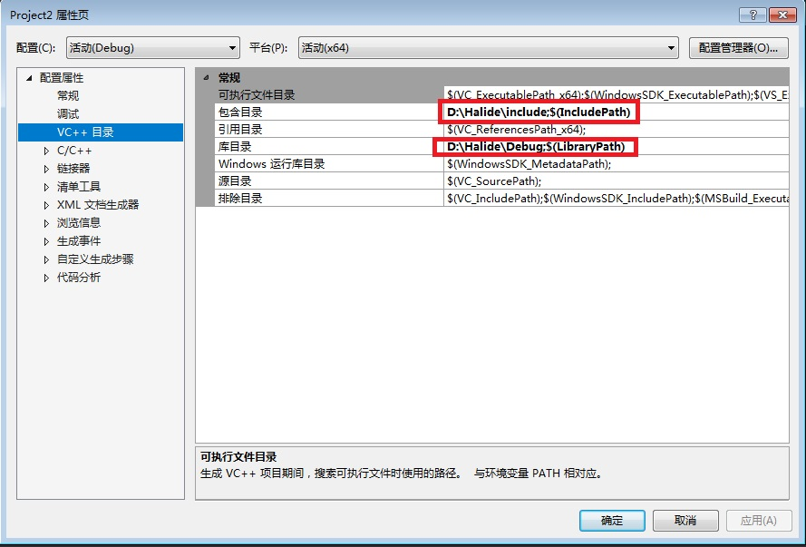
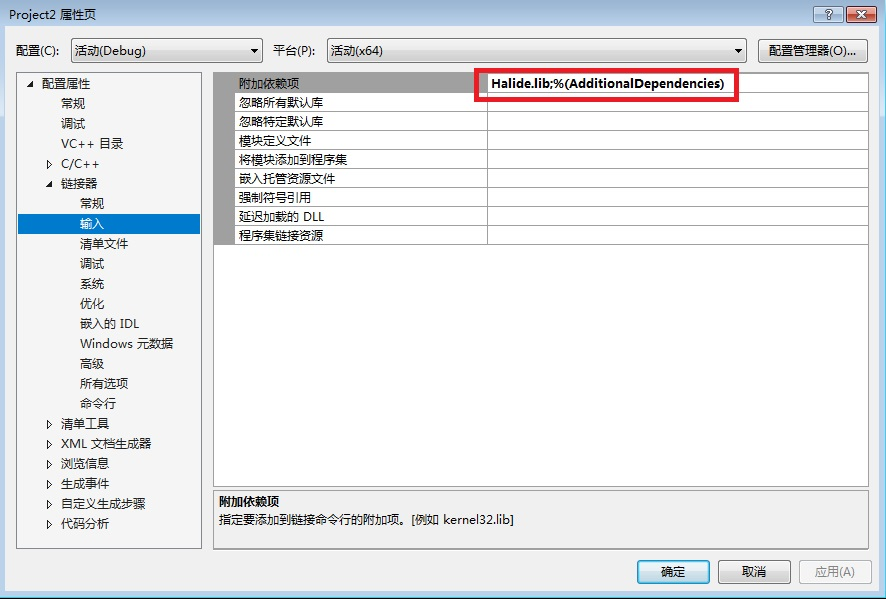
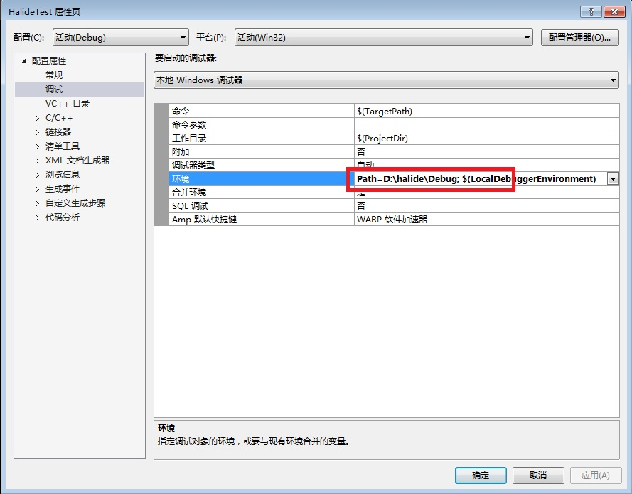
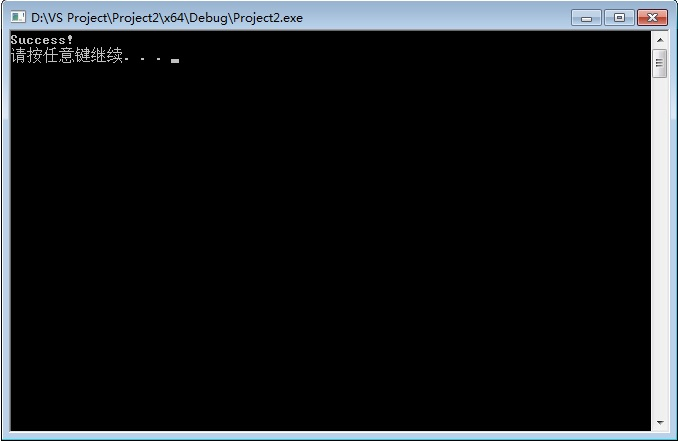
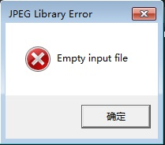

# Halide的配置和使用

### 如何在VS2017中包含Halide的.h .lib .dll文件

- 解压已经下载的Halide环境包（解压后的文件夹可以放在任意目录下）

- 打开VS2017，创建一个空的c++项目

- 右键解决方案下的项目名，点击属性选项

  

- 如下图添加VC++目录，包含目录和库目录分别添加Halide环境路径

  

  **注：**这里因为在Debug环境下配置，所以库路径选择了Debug文件夹，若为Release，请更改相应文件夹。

- 这时如果我们创建一个.cpp文件已经可以#include "Halide.h"了，但若是写一段Halide程序并运行会提示链接失败，因为我们还未明确需要使用到的.lib文件名称。

- 我们只需要在链接器 -> 输入 ->附加依赖项中添加Halide.lib即可。

  

- 现在我们已经可以点击运行了，但是运行的时候会弹窗提示我们缺少Halide.dll，我们只需要在调试选项中的环境内添加Path=你的.dll所在**文件夹**路径+";"即可，具体操作如下图：

  

- 到此，在VS2017中配置Halide项目的环境流程结束。

- 以下是附带的测试配置是否成功的.cpp文件代码。

  ```c++
  #include "Halide.h"
  #include <stdio.h>

  int main(int argc, char **argv) {

  	Halide::Func gradient;
  	Halide::Var x, y;
  	Halide::Expr e = x + y;
  	gradient(x, y) = e;
  	Halide::Buffer<int32_t> output = gradient.realize(800, 600);

  	for (int j = 0; j < output.height(); j++) {
  		for (int i = 0; i < output.width(); i++) {
  			if (output(i, j) != i + j) {
  				printf("Something went wrong!\n"
  					"Pixel %d, %d was supposed to be %d, but instead it's %d\n",
  					i, j, i + j, output(i, j));
  				return -1;
  			}
  		}
  	}
  	printf("Success!\n");
  	system("pause");
  	return 0;
  }
  ```

  **测试结果如下：**

  

### 如何在Halide中处理图片

**注：本章节除了需要Halide库之外，还需要libpng以及libjpeg库，这里我们使用x86平台编译完成的库文件**

上一小节我们已经讲解了如何配置Halide库文件，这一节我们将使用Halide进行简单的图片处理，但在这之前我们必须先配置另外两个库，libpng与libjpeg，方法如下：

- 解压附带的Halide&libjpeg&libpng(x86)压缩包

- 打开我们的VS2017工程，同样还是打开我们project的属性页面

- 在VC++的目录中添加以下路径：

  - 包含目录：添加...\libpng;...\libjpeg\include;（“...”用libpng与libjpeg文件夹的所在路径替换）

  - 库目录：添加...\libpng\projects\vstudio\Debug;...\libjpeg\lib;（"..."同上）

- 在链接器 -> 输入 ->附加依赖项中添加：libpng16.lib;zlib.lib;jpeg.lib

- 由于**上一节**我们已经写过调试器的环境参数，故只要把...\libpng\projects\vstudio\Debug下的libpng16.dll与 ...\libjpeg\bin下的jpeg62.dll丢入环境参数标明的文件夹即可。

- 最后，我们还需要在C/C++ -> 预处理器 -> 预处理器定义中添加 _CRT_SECURE_NO_WARNINGS，来防止因为使用了不安全函数fopen产生的报错。

**至此libpng以及libjpeg的配置工作就已经完成，接下来可以创建一个main.cpp进行图片处理。这里我们使用官方教程中的代码：**

```c++
#define NOMINMAX  //不加会使Halide::min以及halide_image_io.h中使用的min函数被认作为宏定义。

#include "Halide.h"
#include "halide_image_io.h"
using namespace Halide::Tools;

int main(int argc, char **argv) {

	Halide::Buffer<uint8_t> input = load_image("D:\input.png"); //使用绝对路径即可

	Halide::Func brighter;

	Halide::Var x, y, c;

	Halide::Expr value = input(x, y, c);

	value = Halide::cast<float>(value);

	value = value * 1.5f;

	value = Halide::min(value, 255.0f);

	value = Halide::cast<uint8_t>(value);

	brighter(x, y, c) = value;

	Halide::Buffer<uint8_t> output =
		brighter.realize(input.width(), input.height(), input.channels()); //brighter函数

	save_image(output, "D:\output.png");

	printf("Success!\n");
	system("pause");

	return 0;
}
```

以下是图片处理的前后结果：

（处理前）


（处理后）


###目前已知的错误

目前已知的错误有：

- 当使用Halide进行jpg图片处理时，会出现以下错误：

  

  该错误目前还未找到原因，使用的是libjpeg6b版本的库，可能是库文件本身的问题。