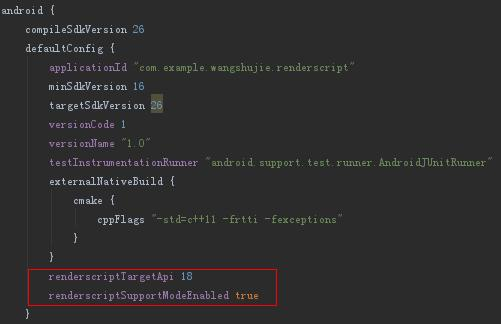
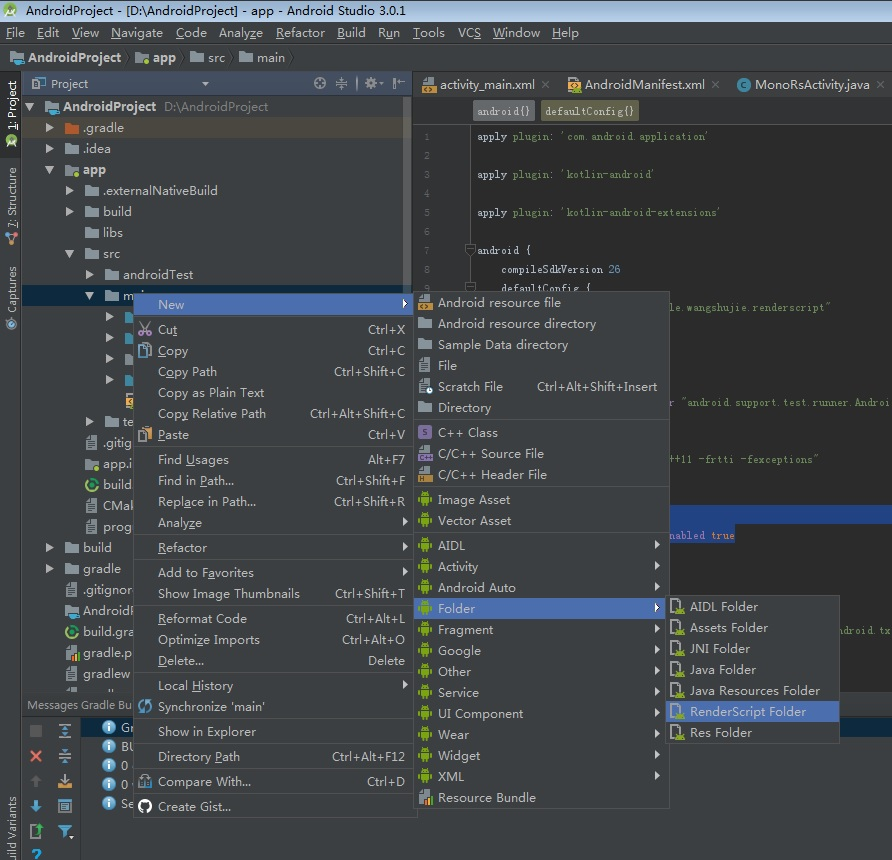
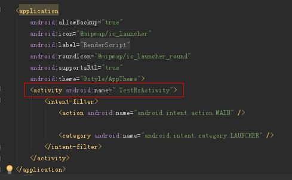
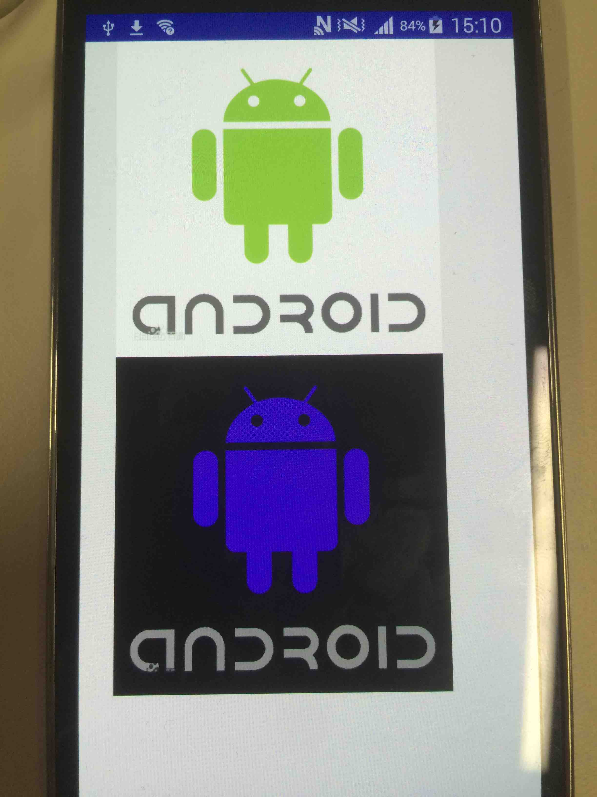

#通过RenderScript产生色反效果实例  

[TOC]

##RenderScript 是什么？

RenderScript 是一款基于Android操作系统，面向移动设备的组件，它可以通过异构硬件来提供更加高效的API。使用RenderScript，开发者会以编写更加复杂（偏向底层）的代码来使他们的应用程序获得更好的表现。它向开发者们提供了三个主要工具：一个简单的3D渲染API、一个与CUDA相似的计算API和一个由c99标准衍生的语言。

RenderScript的 特点：

- RenderScript被设计为在Android平台运行，无需顾忌硬件类型，且所有的性能调优都是在运行时完成的。
- RenderScript被设计为在运行时调整任务，以此可以在底层硬件上进行有效地拆分和并行运算。
- RenderScript的轻便性依靠的是特定设备的驱动程序，所有设备都有一个基本的只使用CPU的驱动程序，但也存在着一些特定的芯片组提供的驱动程序，可以让GPU运行RenderScript。（从Android4.2版本开始，除了利用CPU进行运算，RenderScript已经可以在支持的系统上利用GPU进行运算了。）

##在AndroidStudio项目下配置RenderScriptApi  

1. 使用AndroidStudio创建一个新项目

2. 在新项目目录下找到.../app/build.gradle文件

3. 在该文件中添加如下代码：  

  ```
   renderscriptTargetApi 18

   renderscriptSupportModeEnabled true
  ```

   位置如下截图：  
     
##创建一个.rs文件
1. 先在.../app/main下创建一个用于存放RenderScript的文件夹  
     
2. 在该文件夹下创建一个.rs文件  
3. 编写相应的RenderScript脚本，这里我们用一个可以实现色反效果的代码作为案例。  
4. 完成脚本后，在菜单栏Build选项下，选择Rebuild Project。  
5. 这时在.../app/build/source/你自己的rs文件夹名/debug/com.example.rs文件下会自动生成ScriptC_XXX.java文件，之后我们在Activity中要调用的函数已经生成在了这个java文件中。   
6. 到这时，我们已经可以开始下一步，编写一个Activity。   

**以下是RenderScript的代码**  

```c
pragma version(1)                                  
//RenderScript的版本，目前为1

pragma rs java_package_name(com.example.rs)       
//该RS脚本之后生成的ScriptC_文件名.java所在的包，括号内的内容可以自己定义

//可以实现色反的函数
uchar4 __attribute__((kernel)) invert(uchar4 in)
{

   uchar4 out = in;

   out.r =255- in.r;

   out.g = 255-in.g;

   out.b = 255-in.b;

   return out;

 }
```

##编写一个可以调用RenderScript的Activity

1. 在.../src/java/com.XXX.XXX.XXX文件夹下建立一个.java文件。
2. 以下是需要填写的案例代码：  


```java
import android.app.Activity;
import android.graphics.Bitmap;
import android.graphics.BitmapFactory;
import android.os.Bundle;
import android.support.v8.renderscript.Allocation;
import android.support.v8.renderscript.RenderScript;
import android.widget.ImageView;
import com.example.rs.ScriptC_TestRS;

public class TestRsActivity extends Activity {
  private RenderScript testRS;
  private Allocation mOutAllocation;
  private ScriptC_TestRS testScript;
  private Bitmap mBitmapIn;
  private Bitmap mBitmapOut;
  
  //Activity的创建函数
  @Override
  protected void onCreate(Bundle savedInstanceState) {
        super.onCreate(savedInstanceState);
        setContentView(R.layout.activity_main);
        mBitmapIn = loadBitmap(R.drawable.droid);                                   
        //请把相应的图片放入.../src/main/res/drawable文件夹下。
        mBitmapOut = Bitmap.createBitmap(mBitmapIn.getWidth(), mBitmapIn.getHeight(),
                mBitmapIn.getConfig());
        ImageView in =  findViewById(R.id.displayin);
        in.setImageBitmap(mBitmapIn);
        ImageView out = findViewById(R.id.displayout);
        out.setImageBitmap(mBitmapOut);
        createScript();
    }
    
   //创建RenderScript实例，调用脚本函数
   private void createScript() {
        testRS = RenderScript.create(this);
        mInAllocation = Allocation.createFromBitmap(testRS, mBitmapIn,
                Allocation.MipmapControl.MIPMAP_NONE,
                Allocation.USAGE_SCRIPT);
        mOutAllocation = Allocation.createTyped(testRS, mInAllocation.getType());
        testScript = new ScriptC_TestRS(testRS, getResources(), R.raw.testrs);       
        //实例化RenderScript中的函数
        testScript.forEach_invert(mInAllocation, mOutAllocation);                    
        //调用RenderScript中的函数
        mOutAllocation.copyTo(mBitmapOut);
    }
    
    //载入Bitmap
    private Bitmap loadBitmap(int resource) {
        final BitmapFactory.Options options = new BitmapFactory.Options();
        options.inPreferredConfig = Bitmap.Config.ARGB_8888;
        return BitmapFactory.decodeResource(getResources(), resource, options);
    }
}
```

**千万不要忘记在drawable文件夹下放入相应的图片，具体位置可以看上面代码段中的注释。**  

**同时，为了让用户可以看见经过处理的图片，需要在activity_main.xml文件中加入如下代码段：**

```xml
 <RelativeLayout xmlns:android="http://schemas.android.com/apk/res/android"
    xmlns:tools="http://schemas.android.com/tools"
    android:layout_width="match_parent"
    android:layout_height="match_parent"
    tools:context=".rs.TestRsActivity">

    <ImageView
        android:id="@+id/displayin"
        android:layout_width="320dip"
        android:layout_height="266dip"
        android:layout_alignParentLeft="true"
        android:layout_alignParentStart="true"
        android:layout_alignParentTop="true" />

    <ImageView
        android:id="@+id/displayout"
        android:layout_width="320dip"
        android:layout_height="266dip"
        android:layout_alignParentLeft="true"
        android:layout_alignParentStart="true"
        android:layout_below="@+id/displayin" />
</RelativeLayout>
```
**到这里，基本的实现流程就结束了，但你可能会发现运行后并没有显示图片，那是因为项目并没有运行我们自己编写的Activity，只要进行如下的操作就行。**

1. 找到.../src/AndroidManifest.xml。
2. 对如下截图的区域进行name的替换。  
   

##结果展示

**这时我们重新Run一下，就可以得到以下的色反效果**  


   

