# Snapdragon Profiler 使用教程

Snapdragon Profiler是一款系统配置和调试工具，旨在帮助开发人员优化Snapdragon处理器驱动设备中的应用程序。这款工具通过三种数据捕获模式显示应用程序的CPU、GPU、DSP、内存、功率、网络连接和设备运行时的发热数据，从多个不同的角度展现设备性能。实时（Realtime）模式下，您可以在设备应用程序运行的同时查看实时度量数据。跟踪捕获（Trace Capture）模式仅捕获Snapdragon处理器驱动设备可用的跟踪事件和数据。快照捕获（Snapshot Capture）模式下，开发人员可借助图形应用程序捕获和调试其OpenGL ES应用程序框架，包括单步调试绘制指令，查看和编辑着色器、程序、纹理以及查看像素历史的能力。

这里以官方的ClothTest为例，使用Snapdragon Profiler时，需要下列步骤。如果移动设备已连接至计算机并通过ADB进行数据传输，可直接跳到第4步。

>### 系统要求
>
>**硬件**
>
>* Windows 7, Windows 8, or Windows 8.1 PC
>* 稍后支持Mac OSX和Linux系统
>
>**软件**
>
>* ADB，可从Android SDK获得
>
>**设备**
>
>* 基于Snapdragon处理器的任何设备
>* 不同的设备配置对Snapdragon Profiler有不同的度量

启动设置和配置

1. 连接设备至安装有Snapdragon Profiler的台式计算机。
2. 确保该设备已开启了“开发人员选项”（Developer Options）。跳转到Android “设置”（Settings）菜单并查找“开发人员选项”（Developer Options）。如果没有看到“开发人员选项”（Developer Options），则跳转至Android“设置”（Settings）->“关于手机”（About phone）->“软件信息”（Software info），然后继续点击“版本号”（Build number）选项直至“开发人员选项”（Developer Options）启用。您可以返回上一步至设置，确认“开发人员选项”（Developer Options）菜单项目可用。
3. 打开Windows PC（或者OSX/Linux终端）上的命令行提示窗口，然后使用命令“adb devices”确认ADB命令识别该设备。

> 如果ADB不能识别该设备，确认USB是否连接到位或者是否已通过无线网对ADB进行了设置。此外，还需验证设备是否已安装了最新版ADB USB驱动器。

> 如果ADB能够识别该设备，但是显示“未授权”（Unauthorized），那么需要通过设备上弹出的授权窗口对PC进行授权。

​	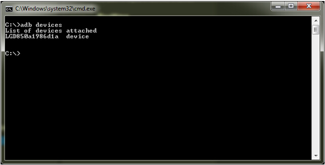

4. 启动Snapdragon Profiler。跳转到“文件”（File）->“连接”（Connect）或者单击“启动页面”（Start Page）中的“连接至设备”（Connect to a Device）选项，如下图所示。

   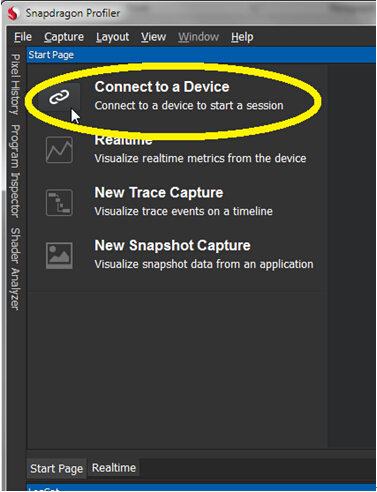

5.   上一步骤将打开连接窗口，该窗口从主窗口的顶部向下滑动，如下图所示。Snapdragon Profiler将通过ADB自动检测连接至PC的任何设备，包括USB和无线网路。

     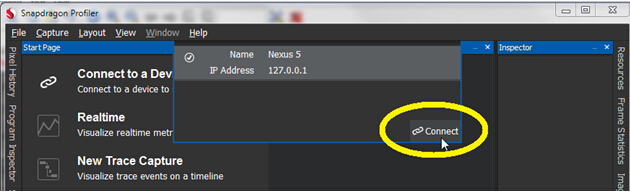

6.   在连接窗口中，选择您想要连接的设备并单击“连接”（Connect）按钮。Snapdragon Profiler将显示一个进程指示器，绿色的选中标识意味着连接过程已完成。然后连接窗口将会最小化。

     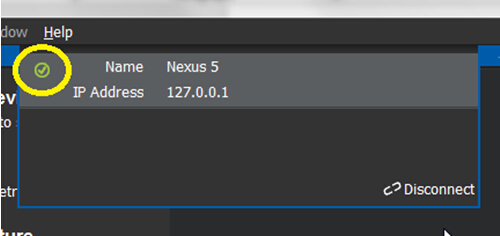

7.   连接成功后，您可以在下列三种模式的任意一种模式下使用Snapdragon Profiler：实时模式、跟踪模式和快照模式

8.   单击“启动页面”（Start Page）中的“实时”（Realtime）按钮或者单击“实时”（Realtime）选项卡，选择并可视化应用程序或设备的实时度量。可汇集CPU、GPU、内存、网络连接、发热和功耗的实时度量。下图显示为实时选项卡的简式窗口。

     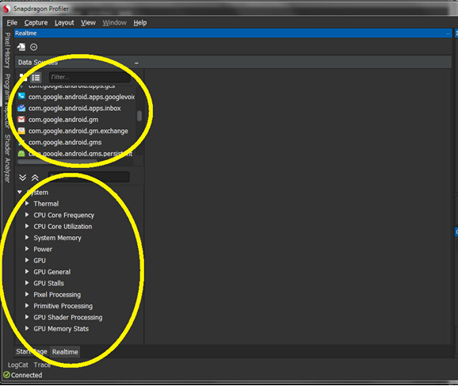

9.   可在实时选项卡左侧数据源面板的底部树形视图中选择系统度量。添加新度量图形时，双击度量或度量类别，或者单击并拖动度量至右侧的图形窗格中。

     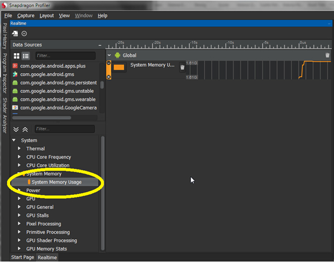

10.   可在数据源面板顶部显示的进度列表中单击一次选中应用程序或者进度度量。默认情况下，Snapdragon Profiler将仅显示用户的进程。当选中一个进程时，该进程可用的相关度量将显示在度量列表中。

   > 将进程度量添加至图形的方法与系统度量一样，即双击或拖放度量至图形中即可。

   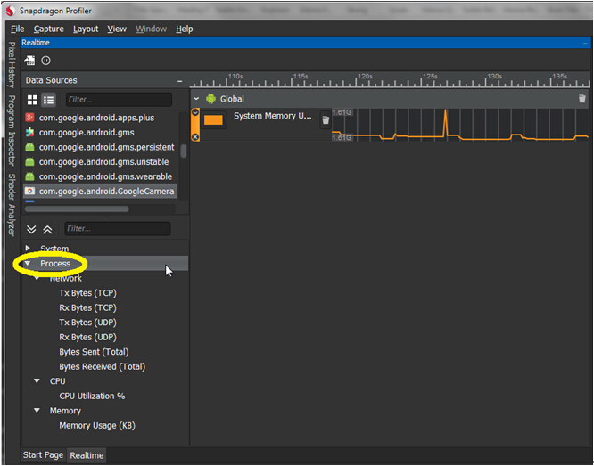

11.   系统度量和进程度量可在图形中同时可视化。甚至是多个进程同时可视化。至于其他分析器，值得注意的是，显示的度量越多，该分析器越能深入的分析应用程序的性能。

      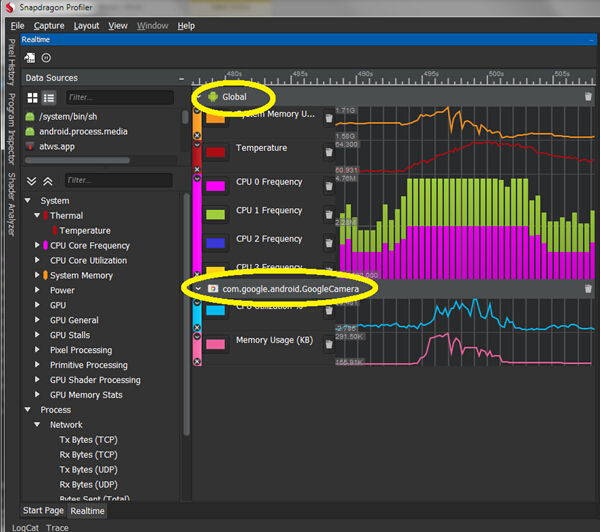

12.   单击“启动页面”（Start Page）的“新建跟踪捕获”（New Trace Capture）按钮或者选中菜单项“捕获”（Capture）->“新建跟踪”（New Trace），查看应用程序或设备跟踪级别的性能数据。选中该选项卡后，将显示一个和实时选项卡极其相似的视图，除了跟踪选项卡设有启动和停止捕获的按钮。

      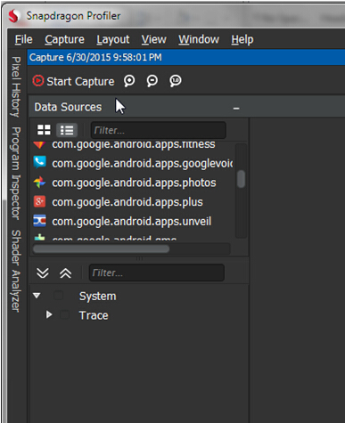

13.   从数据源面板中选择您想要可视化的度量。您可以从进程列表中选择一个进程，可视化该进程特定的度量（如果存在）。选择度量后，单击“开始捕获”（Start Capture）开始跟踪捕获。

      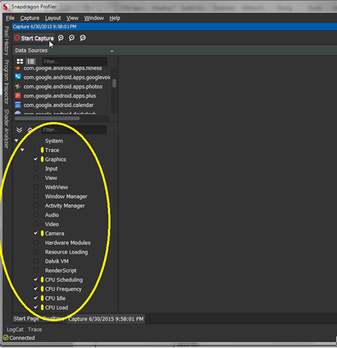

14.   单击“停止捕获”（Stop Capture）按钮停止跟踪捕获。请注意，Snapdragon Profiler跟踪捕获的时间不允许超过10秒。

      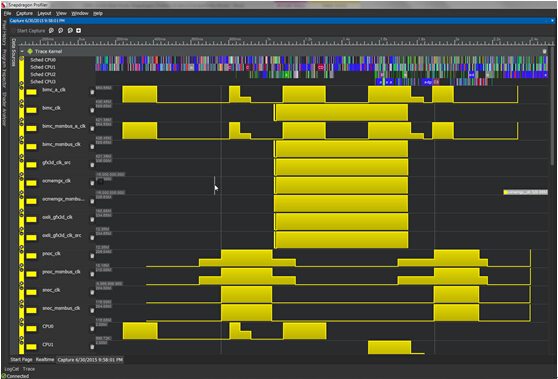

15.   单击“启动页面”（Start Page）的“新建快照捕获”（New Snapshot Capture）按钮，或者选择菜单项“捕获”（Capture）->“新建快照”（New Snapshot），打开可以捕获图形应用程序单个帧的视图。新的快照捕获选项卡将创建成功。

      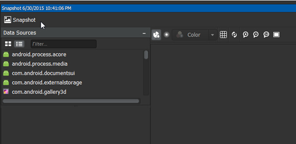

16.   创建应用程序的快照时，首先从快照选项卡的进程列表中选择应用程序。选择进程后，快照可用的度量将显示在度量窗格中。

      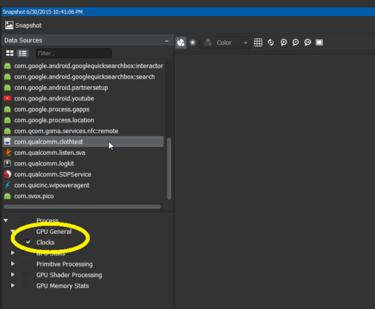

17.   选择您想要在快照中查看的任何度量，然后单击“快照捕获”（Snapshot Capture）按钮捕获帧。捕获后，您可查看捕获的数据并逐步跟踪渲染绘制指令的帧。

      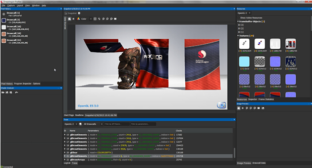

最后，给一个剖析**崩坏3**的截图

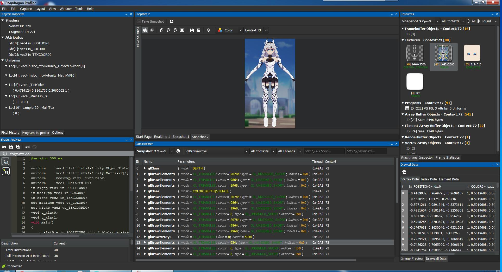

（完）