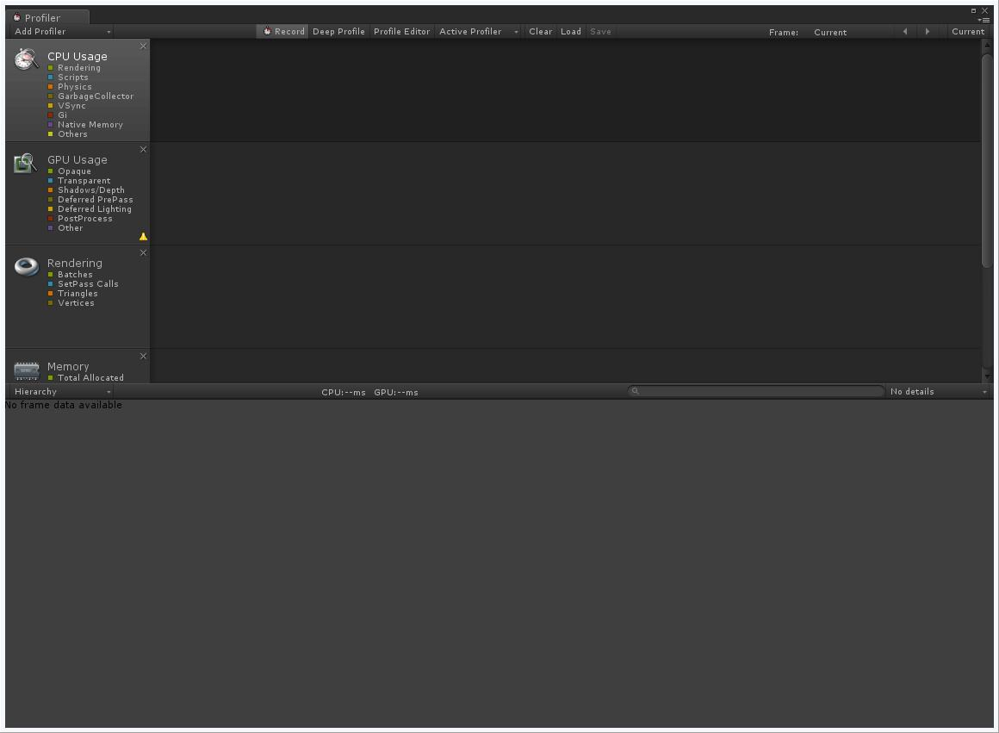
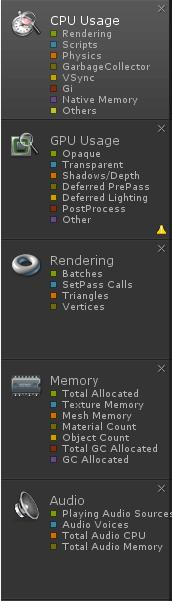
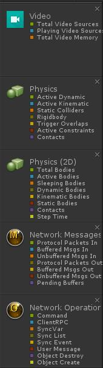
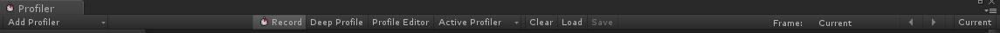
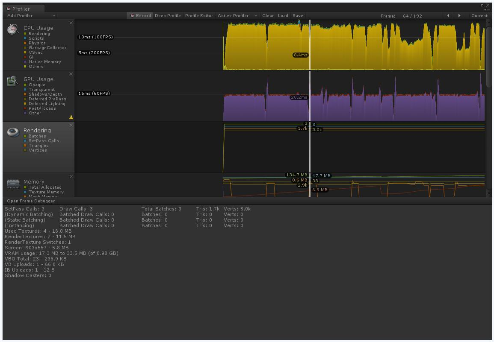
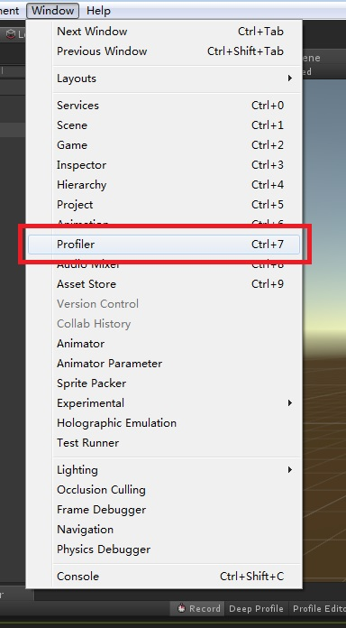
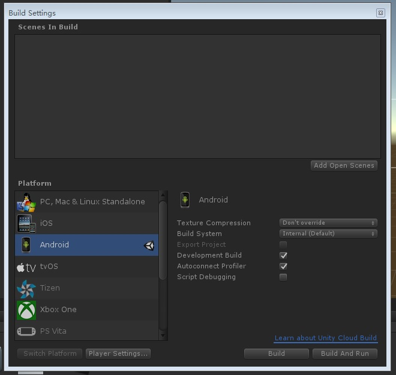

# Unity Profiler使用说明  

[TOC]

### 概述  

本文的Unity版本为5.5.X或更新版本。  

Unity Profiler可以向我们提供游戏运行时性能表现的详细信息。如果我们的游戏存在性能问题，如低帧率或者高内存占用，使用Unity Profiler可以帮助我们发现问题的起因，了解不同任务使用了多少cpu时间，物理运算执行的频繁程度，最终协助我们解决问题。  

### Unity Profiler布局

在我们开始使用Profiler之前，可以先熟悉一下它的界面布局。

Unity Profiler的打开方式：菜单Window选项 > Profiler

注：在游戏运行时，Profiler界面才会产生数据。

### Profiler界面中的各个Profilers

首先先看下各个Profilers的截图。

 

从上图我们可以看见，Unity Profiler一共有以下性能分析功能，它们分别是：

- 查看CPU使用情况

- 查看GPU使用情况

- 查看渲染所用到的Batches、Vertices数量等参数

- 查看内存的占用情况

- 查看音频占用的CPU、内存、音量等情况

- 查看视频的占用情况

- 查看3D或者2D物体的物理运算消耗

- 查看网络的使用情况

###如何控制Unity Profiler

我们可以在Profiler的顶部找到Unity Profiler的控制方法，截图如下：

分析器控件在窗口顶部的工具栏。使用这些控件打开和关闭分析，浏览分析好的帧等。传输控件在工具栏的最右端。请注意，当游戏运行、分析器收集数据时，点击任何这些传输控件（那两个小箭头）将暂停游戏。控件转到记录的第一帧，一步一帧向前(左箭头)，一步一帧向后（右箭头），分别去到最后一帧。分析器不保留所有记录的帧，因此第一帧的概念，事实上应该是仍然保存在内存中的最旧的一帧。 "current"按钮会使得分析统计窗口显示实时采集的数据。激活分析器（Active Profiler）弹出菜单让你选择是否应在编辑器或一个或独立播放器进行分析（例如，一个游戏运行在iOS设备）。

当你打开深度分析（Deep Profile），所有脚本代码将被分析 - 也就是说，所有的函数调用被记录。知道确切在你的游戏代码中花费的时间，这是有用的。

注意深度分析（Deep Profiling）会造成非常大的开销，并使用大量的内存，结果你的游戏在分析同时运行明显变慢。如果您使用的是复杂的脚本代码，深度分析可能不会完全有效。深度分析为使用简单的脚本的小游戏工作足够快。如果您发现您的整个游戏在深度分析时运行，导致帧速率下降很多，以至于游戏几乎不能运行，你应该考虑不采用这种方法，而是使用下面描述的方法。您可能会发现深度分析更有利于设计你的游戏，并确定如何最好地实现关键特性。注意深度分析，对于大型游戏可能会导致Unity耗尽内存，基于这个原因，深度分析未必有效。

手动分析脚本代码块比使用深度分析产生更小的开销。使用Profiler.BeginSample和Profiler.EndSample函数，启用和禁用分析代码段（从Profiler.BeginSample 到Profiler.EndSample间的代码）。

当运行在一个固定的帧率或带垂直空白同步运行，Unity在"Wait For Target FPS"记录等待时间，默认情况下，该段时间没有显示在分析器。要查看等待花费多少时间，您可以切换"View SyncTime"。这也是衡量多少余量你之前丢失帧。

分析器窗口的上部显示随着时间的推移的性能数据。当您运行游戏，每一帧数据被记录，最后则会显示几百帧的历史。点击一个特定的帧上，该帧的细节将显示在窗口的下部。具体取决于当前选定的时间轴区域显示不同的细节。

时间轴的垂直刻度是自动管理，并尝试填补窗口的垂直空间。请注意，要获得更多关于CPU的使用率(CPU Usage)的细节，您可以删除内存（Memory ）和渲染（Rendering ）区域。此外，时间轴和统计区域之间的分离器能被选择和向下拖动，为时间轴图表增加屏幕面积。

时间轴包括几个方面：CPU使用率，渲染和内存。这些区域可以在面板上按一下关闭按钮删除和 在分析控件（Profile Controls）工具栏中使用Add Area 下拉菜单再次重新添加。

### 如何录制分析数据

- 现在我们了解了profiler的界面布局，我们需要继续学习如何录制数据，以及如何解读数据来帮助我们理解游戏的性能。我们需要明白，当录制数据时，游戏性能会受到微小的影响，一般的性能分析工具都存在这个问题，想要获取深入的信息而没有额外的消耗是不可能的。我们可以在unity editor中运行游戏时进行分析，也可以在游戏的**development build**运行时进行分析。development build的unity游戏和常规build有两方面不同：development build在游戏运行时可以连接profiler，并且包含了调试用的文件。
- 在development build中进行性能分析通常要比在unity editor分析要好。有两个原因：第一，性能和内存占用等数据要比在unity editor中准确，因为profiler本身也属于editor的一部分，这会影响结果。第二，最好在我们游戏的目标平台上进行性能分析，如果我们的游戏是安卓游戏，那么我们应该在一个安卓设备上进行测试。一些问题可能只会在特定的硬件或者特定的操作系统上出现，而我们如果只是用unity editor进行测试，就无法发现这些问题。
- 虽然如此，有时我们在unity editor中进行分析也是有一定作用的。有时我们需要快速的了解游戏大体上的性能，并不需要精确的结果，此时可以在unity editor中进行分析。例如，我们也许需要在运行时启用或禁用大量的游戏对象，查找是哪一个游戏对象引起的性能问题，在unity editor中测试这些更改是比development build要方便很多的，当我们粗略的发现问题大概范围时，再在development build中进行分析，就能获取更加准确的信息帮助我们处理这个问题。

### 在Unity Editor上进行分析

在unity editor中进行录制分析的步骤如下：

- 在unity中打开游戏工程
- 菜单中打开profiler **Window** > **Profiler**
- 确保Profiler窗口顶部的**Record**按钮为选中状态
- 在**Play Mode**中运行游戏

此时Profiler会随着游戏中的互动实时的显示分析数据。

### 在development Build中进行分析

步骤如下：

- 在unity中打开想要分析的项目
- 菜单中打开profiler **Window** > **Profiler**
- 确保Profiler窗口顶部的**Record**按钮为选中状态
- 打开build settings**（File > Build Settings）**
- 勾选Development Build
- 勾选Autoconnect Profiler
- 点击**Build and Run**

此时Profiler会随着游戏中的互动实时的显示分析数据。

### 结束语

相信通过以上对Unity Profiler简短的介绍，您已经对如何使用Profiler有了基本的了解。接下来您就可以在自己的项目中，使用Unity Profiler来观察项目的实时运行情况，以此来对其进行优化了。