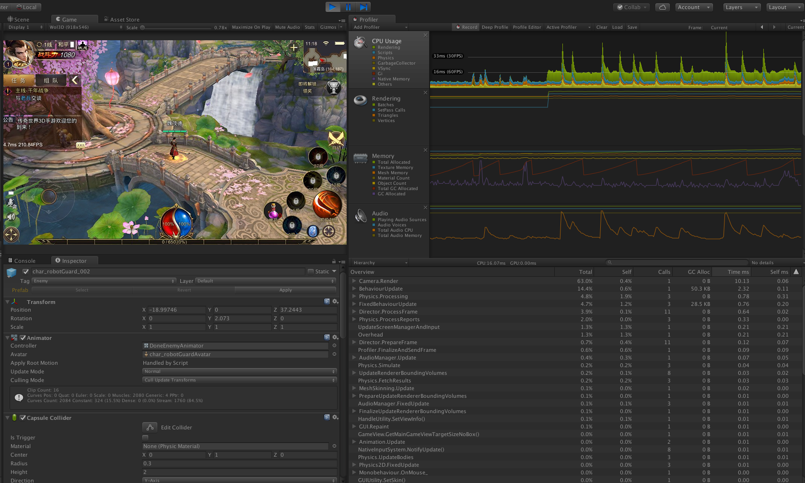
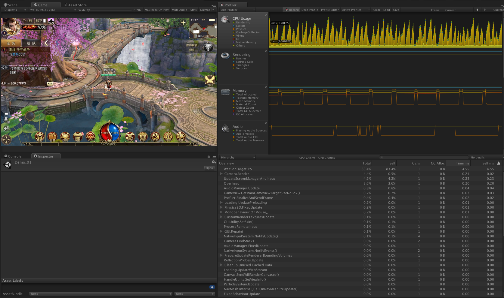
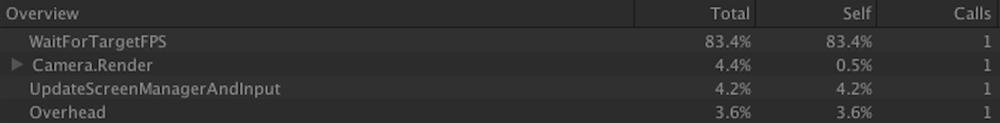
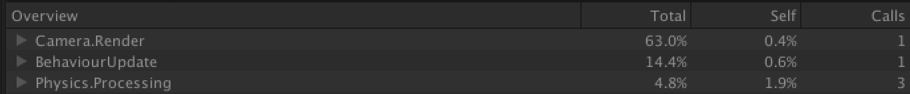

#《传世3D》游戏优化

对公司的现有项目《传世３Ｄ》做性能优化，主要集中在了ＣＰＵ的后期效果优化和内存优化方面。

最为直观有效的说明就是，对优化前后的性能参数的比对

### 优化前

### 优化后

前后最明显的差异就在

其每一次Camera.Render相比没做优化前的

有的极大的节省，虽说没有看到的有一个数量级的节省，其实已经有极大的改善。

Overhead也从占用总开销的3.6%降到1.3%，这也说明ＣＰＵ的使用得到了更有效的改进，许多的冗余代码从中得以剔出。

这样的结果，来自多次优化工作的迭代，每一次迭代

来自于

