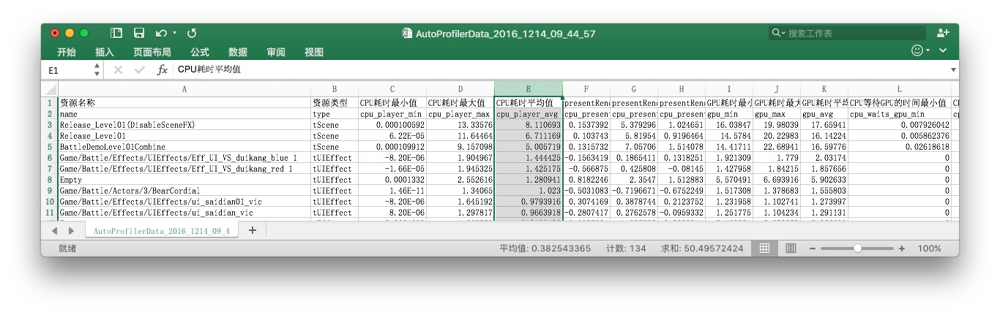

## 对比Unity Profiler工具与Xcode Instruments的优缺点

[TOC]

### 概述

本文的Unity版本为5.5.X或更新版本。

做性能剖析，应该建立记录剖析后的结果数据的习惯。长期跟踪整个研发周期里不同阶段获得的，游戏在具体设备上运行后的各方面性能参数。能从整体去比对不同时段、不同版本间的性能差别。本人，更喜欢记录到一个Excel中

游戏资源长期性能监控工具报表

### Unity Profiler

Unity Profiler能定量地找到C#的GC Alloc问题；其Timeline视图也能从地整体（但不太定量）找到CPU瓶颈。

Unity Timeline Profiler

### Xcode Instruments

XCode的GPU Report视图能从整体（但不太定量）找到游戏的瓶颈阶段。当Frame Time中CPU大于GPU时，表示CPU是瓶颈，否则表示GPU是瓶颈；当Utilization中的TILER比RENDERER高时，表示顶点处理是GPU的瓶颈，否则表示像素处理是GPU的瓶颈。
帧率受限于瓶颈，应优先优化瓶颈阶段，非瓶颈阶段优化得再快都无法提高帧率。

GPU Report
XCode的Capture GPU frame功能能高效且定量地定位到GPU中shader的消耗。

XCode Capture GPU frame

Instruments的TimeProfiler能**高效且定量**地定位C#脚本（IL2CPP后的C++代码）的CPU占用，甚至包括部分Unity引擎代码的CPU占用函数消耗，而不必麻烦地添加BeginSample()、EndSample()。

Instruments Time Profiler

