# 用Instruments做Unity在iOS平台的性能调试

[TOC]

## 简介

Instruments 是 Xcode 的一个工具集，提供了强大的程序性能分析及测试能力。使用 Instruments 可以做下面这些事：

* 检查一个或多个应用或进程的行为。
* 检查设备相关的功能，比如：Wi-Fi、蓝牙等。
* 在真机或模拟器上进行性能测试。
* 创建自定义的 DTrace 来分析系统以及应用的各种行为。
* 跟踪源码中的问题。
* 对 App 进行性能分析。
* 查找 App 中的内存问题，比如：内存泄露(Leaked memory)、废弃内存(Abandoned memory)、僵尸(zombies)等。
* 给出程序优化的建议。
* 进行系统级别的问题定位。
* 通过脚本记录一个用户行为序列，从而可以通过运行脚本对 iOS 应用进行可重复多次的自动化测试。
* 保存测试配置模板以供复用。

Instruments 功能很多，这里先介绍一下在开发中常用到的几种：CPU 性能测试、图形性能测试、内存性能测试。

虽然 Instruments 是 Xcode 的一个工具集，但是它是以一个独立的 App 的形式存在的，可以在 Xcode -> Open Developer Tool -> Instruments 中打开它。

## CPU的性能

要看程序执行时间性能，主要有下面几步：

1. 先在 Xcode 中对当前的项目做 Profile (Command-I)：

   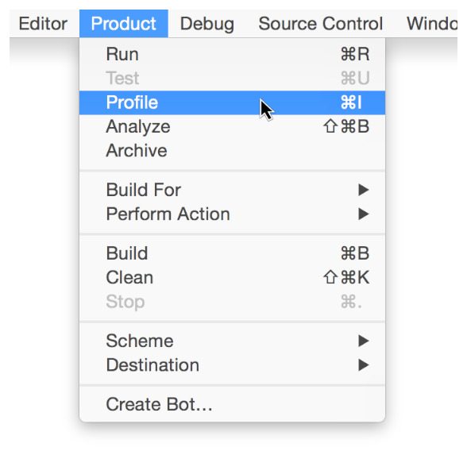

   这时就会打开 Profiling Template 选项对话框：

   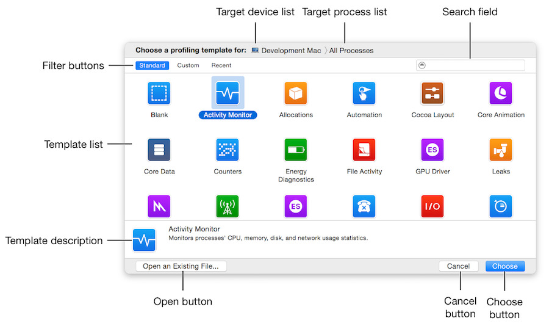

2. 选择 `Time Profiler` 这个模板，并点击 `Choose` 按钮。

   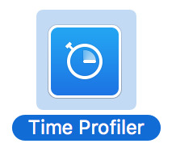

3. 进入 Instruments 后，选择正确的设备和Unity输出的iOS程序，这里临时选择一个iOS App作为示例：

   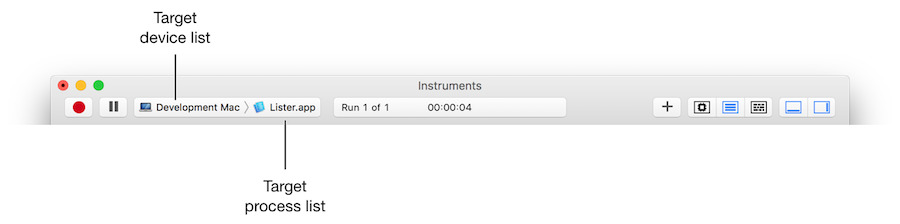

4. 点击红色按钮运行后，就能得到iOS平台下 CPU 性能的结果了，下面是在模拟器里的截图：

   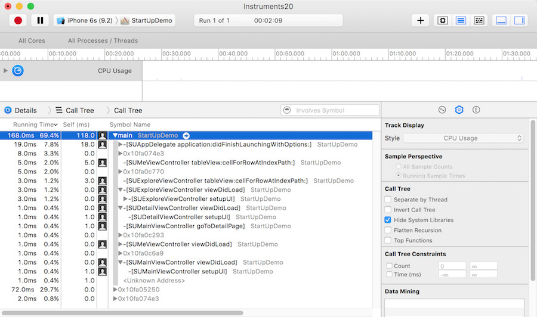

   还能在时间轴面板里面去选择一段时间来查看该时间段里更为细节的 CPU 性能：

   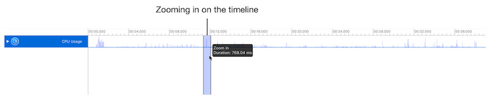

   同时在中间的导航条以及右下角的控制面板中，还可以通过不同的选项来选择数据展示的形式和维度。

   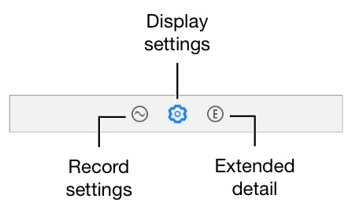

   从这个结果中，可以看到不同的线程以及方法调用占用的时间，从而可以评估出 CPU 性能的瓶颈和优化方向。

5. 除此之外，还能在 Instruments 选择使用 `Counters`、`Activity Monitor`、`System Trace` 等 Profiling Template 对程序做 CPU 性能考量。

6. 需要注意的是，有时候如果使用 Instruments 查看调用栈时可能看到的都是地址而不是函数名，这样就不太好定位问题了。这时候可以把相关项目的 Build Settings - Debug Information Format 的 Debug 和 Release 都设置为 `DWARF with dSYM File`，这样就能将对应的堆栈信息符号化显示了。

##　图形性能

关于图形性能方面，平时最关注的应该就是「帧率」这个概念了。在 Instruments 中，可以使用`Time Profiler` 来评估图形性能。使用步骤如下：

1. 同「CPU 占用性能测试」一样，先在 Xcode 中对当前的项目执行 Profile (Command-I)，并在打开的对话框中选择 `Time Profiler` 这个模板：

2. 进入 Instruments 后，选择正确的设备和应用程序。

3. 点击红色按钮运行应用程序，接下来操作 App 界面，就可以看到帧率的变化和数据了：

   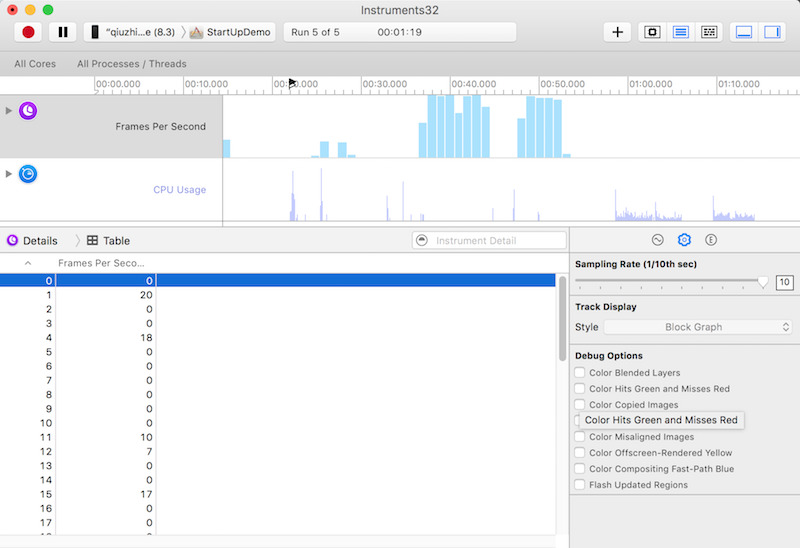

   在滑动屏幕时，帧率越高表示性能越好，帧率过低则意味着屏幕可能会出现卡顿。

4. 在右下角面板的 Display Settings 区域，可以看到多个 Debug Options：

   * `Color Copied Images`，对于 GPU 不支持的色彩格式的图片只能由 CPU 来处理，把这样的图片标为蓝色。**蓝色越多，性能越差。**因为，不希望在滚动视图的时候，由 CPU 来处理图片，这样可能会对主线程造成阻塞。
   * `Color Misaligned Images`，这个选项检查了图片是否被缩放，以及像素是否对齐。被放缩的图片会被标记为黄色，像素不对齐则会标注为紫色。**黄色、紫色越多，性能越差。**
   * `Color Offscreen-Rendered Yellow`，这个选项会把那些离屏渲染的图层显示为黄色。**黄色越多，性能越差。**这些显示为黄色的图层很可能需要用 shadowPath 或者 shouldRasterize 来优化。
   * `Color OpenGL Fast Path Blue`，这个选项会把任何直接使用 OpenGL 绘制的图层显示为蓝色。**蓝色越多，性能越好。如果使用 GLKView 或者 CAEAGLLayer，那如果不显示蓝色块的话就意味着程序正在强制 CPU 渲染额外的纹理，而不是绘制到屏幕。
   * `Flash Updated Regions`，这个选项会把重绘的内容显示为黄色。**不该出现的黄色越多，性能越差。**通常希望只是更新的部分被标记完黄色。

   可以使用这些选项，来监测更加具体的图形性能。

5. 还可以选择使用 `OpenGL ES Analysis`、`GPU Driver` 等模板来监测图形相关性能。

## 内存性能

用Instruments 可以了解到应用程序使用内存的几个方面：

- `全局内存使用情况(Overall Memory Use)`: 从全局的角度监测应用程序的内存使用情况，捕捉非预期的或大幅度的内存增长。
- `内存泄露(Leaked memory)`: 未被程序引用的，同时也不能被使用或释放的内存。
- `废弃内存(Abandoned memory)`: 被程序引用的，但是没什么卵用的内存。
- `僵尸对象(Zombies)`: 僵尸对象指的是对应的内存已经被释放并且不再会使用到，但是程序却在某处依然有指向它的引用。在 iOS 中有一个 NSZombie 机制，这个是为了内存调试的目的而设计的一种机制。在这个机制下，当 NSZombieEnabled 为 YES 时，当一个对应的引用计数减为 0 时，这个对象不会被释放，当这个对象再次收到任何消息时，它会记录一条 warning，而不是直接崩溃，这样就可以以方便程序调试。

查找内存泄露的过程：

1. 同「CPU 占用性能测试」一样，先在 Xcode 中对当前的项目执行 Profile (Command-I)，并在打开的对话框中选择 `Leaks` 这个模板：

   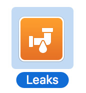

2. 进入 Instruments 后，选择正确的设备和应用程序。

3. 点击红色按钮运行应用程序，可以看到如下界面：

   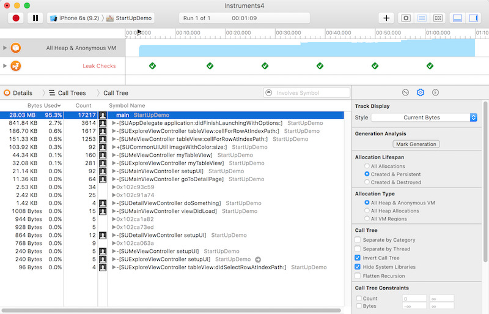

4. 在 Display Settings 中勾选 `Invert Call Tree` 和 `Hide System Libraries` 或其它选项可以过滤显示的数据。

   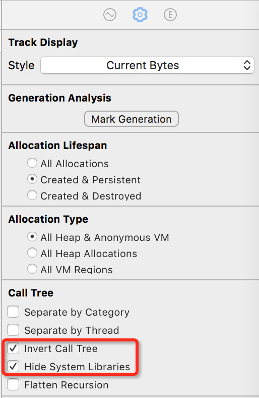

5. 在导航栏的筛选框中，可以输入关键字来筛选数据。

6. 在实际使用中，进入一个页面后再退出，发现相关的内存分配没有清空，这时候就发生内存泄露了。查看更细节的调用信息，追踪到可能造成内存泄露的代码位置：

   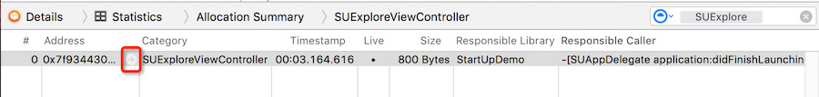

7. 还可以使用 `Activity Monitor`、`Allocations`、`Zombies` 等模板来针对性地做内存监测。