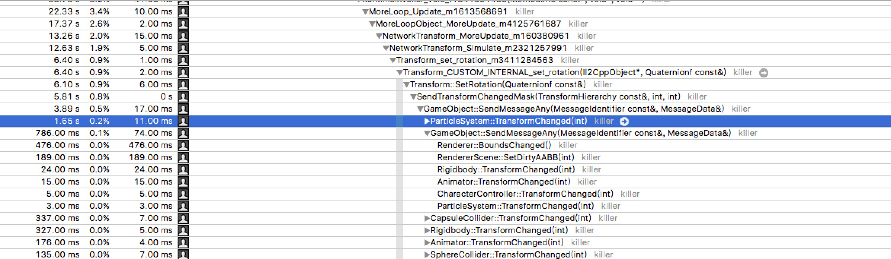
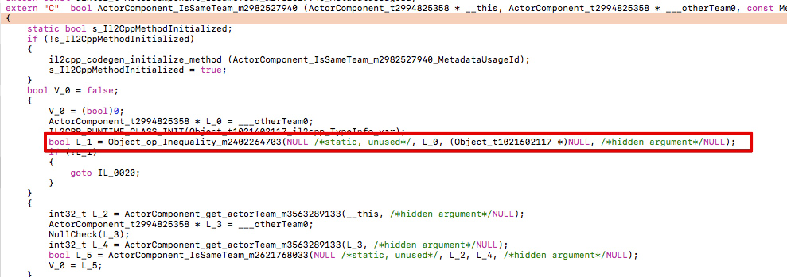
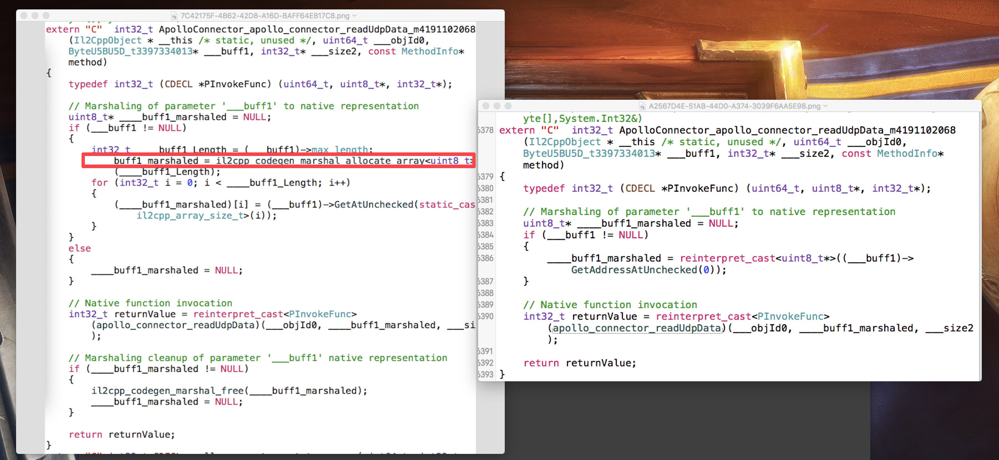

# 写更适合Unity的C#代码来提高性能

[TOC]

### GameObject的SpawnPool应支持“移出屏幕”功能

GameObject（比如特效）可能会被频繁的在“使用中”、“不使用”的状态间切换。我们的SpawnPool不应过快地把“刚刚不使用”的GameObject立刻Deactivate掉，否则会引起不必要的Deactivate/Activate的性能消耗。应有一个“从热变冷”的过程：“刚刚不使用”只是移出屏幕；只有“不使用一段时间”的GameObject，才会得以Deactivate。可能的实现方式如下：

```C#
/// On each timer, we try to make parts of "hot" items to be "cool" by deactivating them.
internal void OnTimer()
{
    if(teleportCache.items.Count > 0) {
        if(Time.realtimeSinceStartup - teleportCache.lastSpawnTime
           < SpawnPool.TeleportThenDeactivateDuration &&
            teleportCache.items.Count <= 3) {
            this.MoreLogInfo("this prefab is recently spawned, \
            and the teleport cache is not too large, \
            we don't deactivate these remaining items");
        }
        else {
            int deactivateCount = Mathf.Max(1, teleportCache.items.Count / 3);
    
            SpawnIdentity oneId;
            while(deactivateCount > 0) {
                --deactivateCount;
                oneId = teleportCache.items.Pop();
                if(null != oneId) {
                    this.MoreLogInfo("Deactivate from teleportCache:" + oneId);
                    oneId.gameObject.MoreSetActive(false, this);
                    oneId.gameObject.transform.SetParent(null, true);
                    deactivateCache.Push(oneId);
    
                    SpawnPoolProfiler.AddDeactivateCount(oneId.gameObject);
                }
            }
        }
    }
}
```


### Transform 的孩子不应过多

当Transform包含不该有的孩子Transform或其他组件时，为该Transform进行position、rotation赋值，会引起消耗，特别是包含粒子系统的时候。



对Transform进行rotation赋值时，由于其孩子包含粒子系统所产生的消耗
但考虑到切换Transform的parent本身也会有消耗，因此，我们对此也应有“从热变冷”的过程：“刚刚不使用”依然保留在父亲Transform里；只有“不使用一段时间”的GameObject，才从父亲Transform移出。

### 应减少粒子系统的Play()的调用次数

每次调用ParticleSystem.Play()都会有消耗，如果粒子系统本身没有明显“前摇”阶段，应先检查ParticleSystem.isPlaying，例子如下：

~~~c#
ParticleSystem ps;

for (int i = 0; i < num; ++i) {

    //m_particleSystemLst[i].Stop();
    ps = m_particleSystemLst[i];
    /// CAUTION! WE SHOULD CHECK isPlaying before calling Play()! 
  	/// OR, IT WILL AFFECT PERFORMANCE!
    if(!ps.isPlaying) {
        ps.Play();
    }

}

~~~


### 应减少每帧Material.GetXX()/Material.SetXX()的次数

每次调用Material.GetXX()或Material.SetXX()都会有消耗，应减少调用该API的频率。比如使用C#对象变量来记录Material的变量状态，从而规避Material.GetXX()；在Shader里把多个uniform half变量合并为uniform half 4，从而把4个Material.SetXX()调用合并为1个Material.SetXX()。

### 应使用支持Conditional的日志输出机制

简单使用Debug.Log(ToString() + "hello " + "world");，其实参会造成CPU消耗及GC。使用支持Conditional的日志输出机制，则无此问题，只需在构建时，取消对应的编译参数即可。

~~~C#
/// MoreDebug.cs，带Conditional条件编译的日志输出机制

[Conditional("MORE_DEBUG_INFO")]

public static void MoreLogInfo(this object caller) { DoMoreLog(MoreLogLevel.Info, false, caller); }

/// 用户代码.cs，调用方简单正常调用即可。正式构建时，取消MORE_DEBUG_INFO编译参数。

this.MoreLogInfo("writerSize=" + writer.Position, "channelId=" + channelId);

~~~

### 依然需要减少GetComponent()的频率

即使在Unity5.5中，GetComponent()会有一定的GC产生，有少量的CPU消耗。如有可能，我们依然需要规避冗余的GetComponent()。另，自Unity5起，Unity已就.transform进行了cache，我们不需再为.transform担心，见《UNITY 5: API CHANGES & AUTOMATIC SCRIPT UPDATING》最后一段。

### 应减少UnityEngine.Object的null比较

因为Unity overwrite掉了Object.Equals()，《CUSTOM == OPERATOR, SHOULD WE KEEP IT?》也说过unityEngineObject==null事实上和GetComponent()的消耗类似，都涉及到Engine层面的机制调用，所以UnityEngine.Object的null比较，都会有少许的性能消耗。对于基础功能、调用栈叶子节点逻辑、高频功能，我们应少null比较，使用assertion来处理。只有在调用栈根节点逻辑，有必要的时候，才进行null比较。



上面C#代码对应的IL2CPP代码

而且，从代码质量来看，无脑的null保护也是不值得推崇的，因为其将错误隐藏到了更偏离错误根源的逻辑。理论上，当错误发生了，应尽早报错，从而帮助开发者能更快速地定位错误根源。所以，多用assertion，少用null保护，无论是对代码质量，还是代码性能，都是不错的实践。

### 应减少不必要的Transform.position/rotation等访问

每次访问Transform.position/rotation都有相应的消耗。应能cache就cache其返回结果。

### 应尽量为类或函数声明为sealed

IL2CPP就sealed的类或函数会有优化，变虚函数调用为直接函数调用。详见《IL2CPP OPTIMIZATIONS: DEVIRTUALIZATION》。

### C#/CPP interop时，不需为blittable的变量声明为MarshalAs

某些数值类型，托管代码和原生代码的二进制表达方式一致，这些称为blittable数值类型。blittable数值类型在interop时为高效的简单内存拷贝，故应值得推崇。C#中的blittable数值类型为byte、int、float等，但注意不包括常用的bool、string。仅有blittable数值类型组成的数组或struct，也为blittable。

blittable的变量不应声明MarshalAs。
比如下面代码，

[DllImport(ApolloCommon.PluginName, CallingConvention = CallingConvention.Cdecl)]
private static extern ApolloResult apollo_connector_readUdpData(UInt64 objId, /*[MarshalAs(UnmanagedType.LPArray)]*/ byte[] buff, ref int size);

注释前后的IL2CPP代码如下图，右侧明显避免了marhal的产生。




