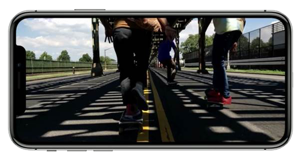
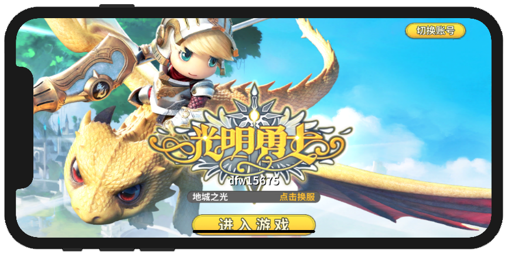

#Unity游戏项目的界面到iPhoneX适配  

[TOC]

### 1. 改变，更好的体验

　　　　　　　　　　　　　　

**iPhoneX新增的改变：**　　

- iPhoneX在屏幕上方新增了一个留海区域。
- iPhoneX取消了屏幕下方的Home键，Home键将显示在触摸屏中。　　

  
  

- 蓝色为屏幕的安全区域。  
- 屏幕上下边界距离安全区上下边界为44pt。
- 粉色区域的宽度各为8pt。 
- 横放时Home指示器的高度为5pt,宽度为209pt。
- 横放时底部白色部分高度为22pt。  

---

### 2. 设计参数

  

- Super Retina屏幕:1pt=3pixels  

  

- iPhoneX的整体高宽为：高812pt、宽375pt

---

### 3. 注意事项

1. 交互元素不要靠近角落

  

由于人反复的做一个动作产生了""肢体记忆"(Musle Memory)，所以要避免左右不对称的交互元素的设计，当横屏模式来个180度翻转时，这会造成使用者“肢体记忆”机能作用下的操作错乱。  

2. 屏幕边缘的视觉元素

  

- 移动这些视觉元素位置，部分情况下要重新设计。  

3. Home指示器 

  

底部按钮要尽量避开Home指示器。

全沉浸体验时，Home指示器的管理：

  
  
  

当没有手势操作有3秒－－>隐藏

轻触屏幕/从屏幕边缘往上滑－－>显示

游戏里实现这个功能，只需要调用经过适配后的一个C#静态函数: 

```C#
static void PlatformIOS.HomeIndicator_EnableHide(bool enable);	// enable时，使得隐藏
```

其底层调用的就是iOS平台的：

```C
[UIViewController setNeedsUpdateOfHomeIndicatorAutoHidden];
```

其具体的控制逻辑，可以由Unity端的C#代码负责。

---

### 4. Unity中的首要设置工作

在Game窗口中加入下面这个屏幕显示设置。

  
 

参照演示工程，模板图片后设置成这样，开始设计。  

  

---

### 5. 以《光明勇士》做适配

**登入**界面


适配修改后




**角色选择A**画面


经过适配后


**角色选择B**画面

经过适配后


底下的**角色名字**输入框没有被遮挡